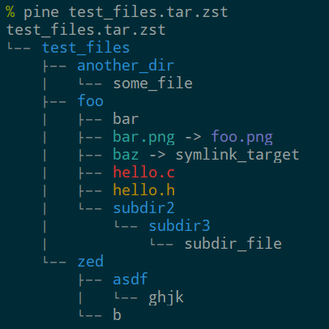

# pine
Print lists of files as a tree.

## Features
pine is similar to the `tree(1)` command, but it can load file/directory trees from more than just
a folder on disk.  Most notably, pine can read a variety of archive formats (e.g. zip or tar) and
display their contents as a tree view, with coloring based on LS_COLORS.

pine can generate a tree from a folder on disk, any archive type
[supported by libarchive](https://github.com/libarchive/libarchive/wiki/LibarchiveFormats), or the
files owned by a Package Manager's package (à la `pacman -Ql pkgname` or `dpkg -L pkgname`).

## Build Requirements
The [libarchive](https://libarchive.org/) C library and its development files are required, as is
the `pkg-config` command.  Due to libarchive's large number of dependencies (mostly compression
formats) it is impractical to compile it from source for a Rust build.  Instead pine relies on an
existing libarchive installation.  For example, install the packages `libarchive pkgconf` on Arch
Linux or `libarchive-dev pkg-config` on Debian/Ubuntu.  You can also build libarchive from source
and set the `PKG_CONFIG_PATH` environment variable when building with cargo.

## To Do List
  * "plain text" input, e.g. the output of `find` or `tar -t` commands
  * load package files for dpkg (pacman is now implemented)
  * cache the parsed package manager database, rather than re-loading it for every separate package
    specified on the command line.
  * filtering on entries to be included or excluded from the listing (including removing metadata
    files from pacman package lists)
  * add tests

## License
Copyright (c) 2021 Allen Wild <allenwild93@gmail.com>

This program is free software: you can redistribute it and/or modify it under the terms of the GNU
General Public License as published by the Free Software Foundation, either version 3 of the
License, or (at your option) any later version.

This program is distributed in the hope that it will be useful, but WITHOUT ANY WARRANTY; without
even the implied warranty of MERCHANTABILITY or FITNESS FOR A PARTICULAR PURPOSE.  See the GNU
General Public License for more details.
